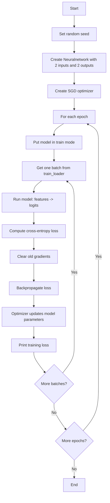
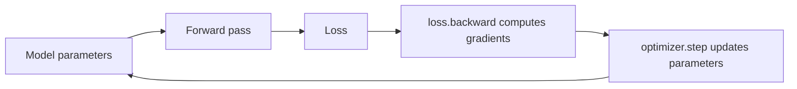
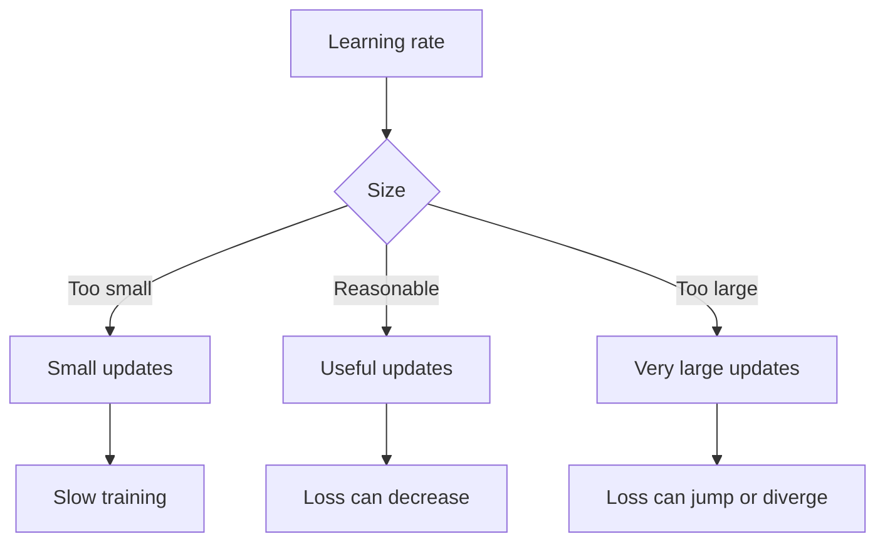
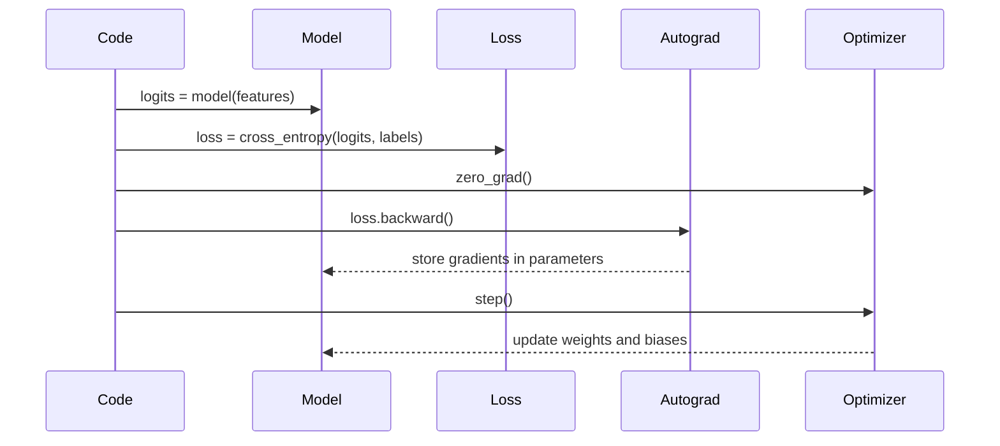
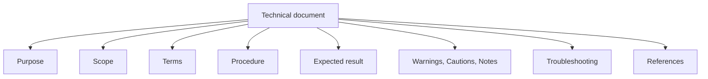

# Training Loop and ASD-STE100-Style Documentation

This note explains `training_loop.py`. It also shows a practical ASD-STE100-style format for technical documentation.

> Note: This document is ASD-STE100-inspired. It is not an official compliance certificate. For formal compliance, use the official ASD-STE100 standard and a trained reviewer.

## 1. Purpose

Explain these items:

- What the PyTorch training loop does.
- What `optimizer` means.
- What the `lr` parameter means.
- How ASD-STE100-style documentation makes technical text clear.

## 2. Source Code

The important code is:

```python
optimizer = torch.optim.SGD(
    model.parameters(), lr=0.5
)
```

and the training step is:

```python
logits = model(features)
loss = F.cross_entropy(logits, labels)

optimizer.zero_grad()
loss.backward()
optimizer.step()
```

## 3. Training Loop Overview

The file trains a small neural network on a toy dataset.



## 4. Important Terms

### Model Parameters

Parameters are the trainable values inside the neural network.

For this model, parameters include:

- Weights in each `Linear` layer.
- Bias values in each `Linear` layer.

The model changes these values during training.

### Logits

`logits = model(features)` runs a forward pass.

Logits are raw prediction scores. They are not probabilities yet.

For this dataset, the model has two output scores because there are two classes:

- Class `0`
- Class `1`

### Loss

`loss = F.cross_entropy(logits, labels)` compares the model output with the correct labels.

Cross-entropy loss answers this question:

> How wrong is the model for this batch?

A smaller loss is better.

## 5. What Is an Optimizer?

An optimizer is the object that updates model parameters.

In this code:

```python
optimizer = torch.optim.SGD(model.parameters(), lr=0.5)
```

`torch.optim.SGD` means stochastic gradient descent.

The optimizer receives `model.parameters()`. This tells it which tensors it is allowed to update.

The optimizer does not decide the loss. The loss function does that.

The optimizer does not compute gradients by itself. `loss.backward()` does that with PyTorch autograd.

The optimizer uses the gradients after backpropagation and changes the parameters.



## 6. What Is `lr`?

`lr` means learning rate.

In this code:

```python
lr=0.5
```

The learning rate controls the size of each parameter update.

For plain SGD, the simplified update rule is:

```text
new_parameter = old_parameter - learning_rate * gradient
```

So with `lr=0.5`:

```text
new_parameter = old_parameter - 0.5 * gradient
```

The learning rate is important:

- If `lr` is too small, training can be slow.
- If `lr` is too large, training can become unstable.
- If `lr` is reasonable, the model can move toward lower loss.



## 7. Why Use `zero_grad`, `backward`, and `step`?

These three lines are the core of the training step.

```python
optimizer.zero_grad()
loss.backward()
optimizer.step()
```

### `optimizer.zero_grad()`

PyTorch stores gradients in each parameter's `.grad` field.

By default, gradients accumulate. This means a new gradient is added to the old gradient.

`zero_grad()` clears old gradients before the next calculation.

### `loss.backward()`

This computes the gradient of the loss with respect to each trainable parameter.

A gradient tells the optimizer the direction in which a parameter should move to reduce the loss.

### `optimizer.step()`

This updates the parameters.

For SGD, it moves each parameter in the opposite direction of its gradient.



## 8. One Code Detail to Notice

The code calls:

```python
model.eval()
```

inside the batch loop.

Usually, training code calls `model.train()` during training and calls `model.eval()` only during validation or testing.

In this specific model, there is no dropout layer and no batch normalization layer. Therefore, this call probably does not change the result.

But in larger models, `model.eval()` inside the training loop can cause incorrect training behavior.

## 9. ASD-STE100 Documentation Format

ASD-STE100 Simplified Technical English is a controlled natural language for technical documentation. The current public official material describes Issue 9, released on January 15, 2025.

The standard has two main parts:

- Writing rules
- A controlled dictionary

The goal is to make technical documentation clear, consistent, and easy to translate.

### Practical Structure

An ASD-STE100-style technical document usually benefits from this structure:

```text
Title
Purpose
Scope
Terms
Prerequisites
Procedure
Expected result
Warnings / Cautions / Notes
Troubleshooting
References
```



### Writing Rules You Can Apply

Use these practical rules when you write code documentation:

- Use short sentences.
- Use one instruction per sentence.
- Use active voice for procedures.
- Use consistent terms.
- Use the same word for the same thing.
- Avoid slang and idioms.
- Avoid unnecessary synonyms.
- Use approved domain terms when the project needs them.
- Put conditions before actions.
- Use lists and tables for scanability.

### Example: Less Clear

```text
The optimizer is kind of responsible for tweaking everything after the loss is figured out, and lr determines how aggressively this tweaking happens.
```

### Example: Clearer

```text
The optimizer updates the model parameters.
The learning rate controls the size of each update.
```

## 10. ASD-STE100-Style Explanation of This Training Step

### Purpose

Train the neural network with one batch of data.

### Inputs

| Name | Description |
| --- | --- |
| `features` | Input values for one batch. |
| `labels` | Correct class values for one batch. |
| `model` | Neural network to train. |
| `optimizer` | Object that updates model parameters. |

### Procedure

1. Send the batch features through the model.
2. Get the logits from the model.
3. Compare the logits with the labels.
4. Calculate the loss.
5. Clear old gradients.
6. Calculate new gradients.
7. Update the model parameters.
8. Print the training loss.

### Expected Result

The model parameters change after each optimizer step.

Over many good training steps, the loss should usually decrease.

## 11. References

- ASD-STE100 official FAQ: https://www.asd-ste100.org/STE_faq.html
- ASD-STE100 about page: https://www.asd-ste100.org/about_STE.html
- ASD-STE100 downloads page: https://www.asd-ste100.org/STE_downloads.html
- PyTorch optimizer concept used here: `torch.optim.SGD`
